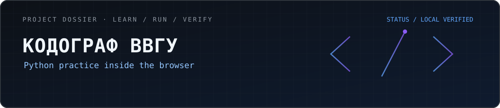
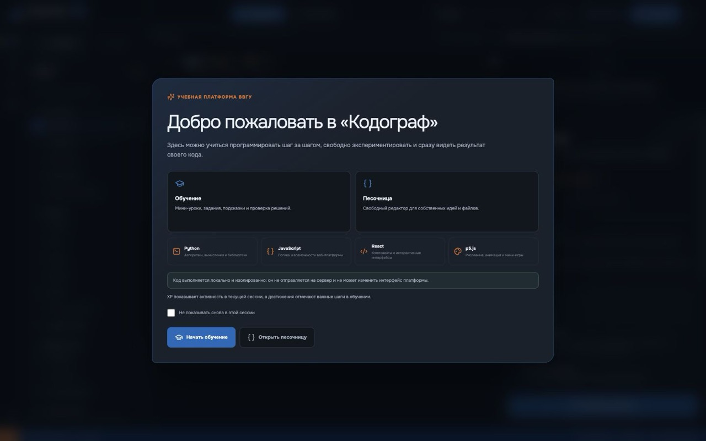
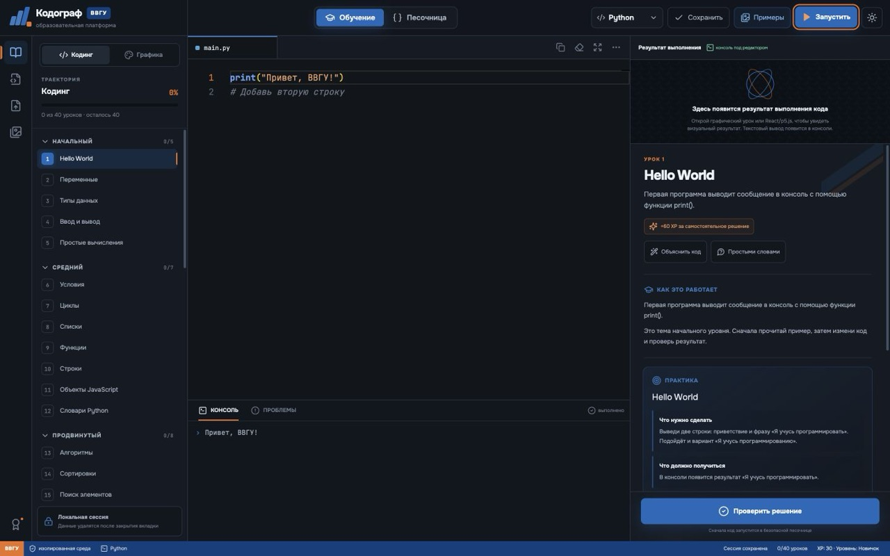
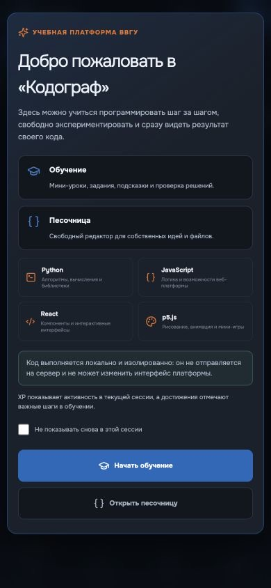
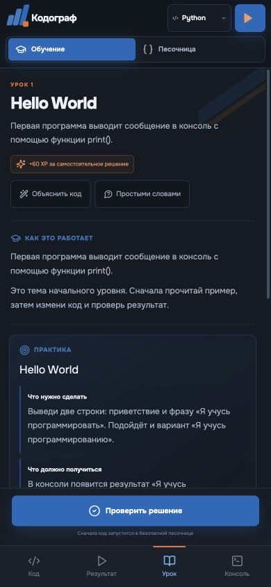

  

  
  &nbsp;
  

  
  

---

# 🎓 Kodograf VVGU

> **A browser-based learning environment where theory, coding and real Python execution live in one flow.**

  
  
  
  
  

> ℹ️ Independent learning concept. It is not an official VVGU service or university partnership.

## 🎯 Project goal

Reduce the distance between learning a concept and practising it.

A student reads an explanation, moves directly into the editor, runs Python and checks their solution without switching between multiple applications.

## 📌 At a glance

| | |
| :--- | :--- |
| 🎓 **Format** | Interactive learning environment |
| 🚦 **Status** | Verified locally |
| 🐍 **Execution** | Python through Pyodide |
| 🧵 **Isolation** | Web Worker |
| 📱 **Interface** | Desktop + mobile |
| 🔒 **Source** | Not included in the public showcase |

## 🖼️ Interface

  

  

  
  &nbsp;&nbsp;
  

## 🧭 Learning loop

1. 📖 open a topic;
2. 💡 study an example;
3. ⌨️ write code;
4. ▶️ execute Python;
5. ✅ check the result;
6. 🧪 continue to the next task or sandbox.

## 🧰 Student tools

- 📚 lessons and practical exercises;
- 🖥️ Monaco Editor;
- 🐍 browser-based Python execution;
- ✅ solution checks;
- 🧪 dedicated sandbox;
- 📱 mobile learning flow.

## ⚙️ Interesting implementation areas

### 🐍 Python without a backend

Pyodide allows Python code to execute directly inside the browser.

### 🧵 Web Worker

Execution is isolated from the main UI so user code does not block the interface.

### 🖥️ Monaco

A full editor makes the learning environment feel closer to a real development tool than a simple text input.

## 🧪 What I focus on

- safe educational execution;
- responsive UI;
- understandable solution feedback;
- lesson-state recovery;
- a clear desktop and mobile flow.

---

  

  <a href="https://github.com/mrjakeball"><strong>GitHub profile ↑</strong></a>

